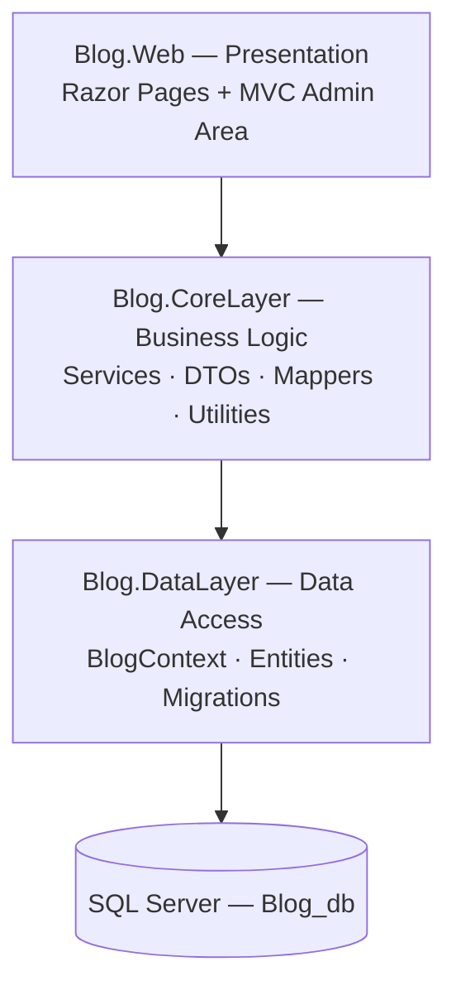

# Blog.Web

> **A full-featured, RTL Persian blog engine** built with **ASP.NET Core 5**, **Entity Framework Core**, and **SQL Server** — featuring a clean layered architecture, a public blog website, and a full admin panel for content management.


---

## 📖 Overview

**Blog.Web** is a complete content-management solution for running a Persian (Farsi) blog:

- A **public website** (Razor Pages) where visitors browse posts by category, read articles, search, and leave comments — with a fully **RTL** UI based on the *Mag* template and the **IRANSans** font.
- An **admin panel** (MVC Area) based on **AdminLTE 3** where administrators manage posts, categories, and users, with **CKEditor 4** for rich-text authoring and image uploads.
- A **3-layer architecture** that cleanly separates data access, business logic, and presentation.

| | |
|---|---|
| **Author** | [Mohammad Hasan Pirayandeh](https://github.com/MohammadHasanp) ([@MohammadHasanp](https://github.com/MohammadHasanp)) |
| **Stack** | C# / .NET 5, ASP.NET Core (MVC + Razor Pages), EF Core, SQL Server |
| **Language of UI** | Persian (RTL) |
| **Database** | SQL Server (code-first with migrations) |

---

## ✨ Features

### Public site
- 🏠 **Home page** — latest posts, special/featured posts, popular posts (loaded via AJAX), and a category navigator with post counts
- 📄 **Post pages** with SEO-friendly **slug URLs** (`/Post/{slug}`), visit counters, related posts, and a comment form
- 🔎 **Search** with filtering by keyword and category, plus pagination
- 📚 **Nested categories** (main categories + subcategories) with SEO meta tags & meta description
- 👤 **User registration & login** (cookie authentication, 30-day persistent session)
- 🛡 Custom **error pages** (404 / 500)

### Admin panel (`/Admin`)
- 📊 Dashboard (AdminLTE 3, RTL)
- ✍️ **Posts management** — create/edit/delete with CKEditor 4 rich-text editor, cover image & in-content image upload, slug uniqueness check, special-post flag
- 🗂 **Categories management** — hierarchical (parent/child), SEO fields
- 👥 **Users management** — search, pagination, edit user info & roles (**Admin / Writer / User**), modal-based editing
- 🔐 **Role-based authorization** — the whole admin area is protected by an `adminPolicy` requiring the **Admin** role

### Architecture highlights
- Clean **3-layer** design with dependency injection everywhere
- **Service interfaces + implementations** (`IXxxService` → `XxxService`)
- **DTO layer** for all inputs/outputs, with dedicated **mapper** classes
- **OperationResult** pattern for consistent success/error results
- Reusable utilities: slug generator, MD5 password encoder, image validation, pagination helper, date helpers, file manager for uploads
- Soft-delete support (`IsDelete`) and audit timestamp (`Time`) built into `BaseEntity`

---

## 🧱 Architecture



| Layer | Project | Responsibility |
|---|---|---|
| **Presentation** | `Blog.Web` | Public Razor Pages site + `/Admin` MVC area, authentication & authorization, static assets (`wwwroot`) |
| **Business Logic** | `Blog.CoreLayer` | Services (Posts, Categories, Users, Comments, MainPage, FileManager), DTOs, mappers, cross-cutting utilities |
| **Data Access** | `Blog.DataLayer` | EF Core `BlogContext`, entities, code-first migrations, SQL Server configuration |

---

## 🛠 Tech Stack

| Technology | Usage |
|---|---|
| **C# / .NET 5** | Target framework (`net5.0`) |
| **ASP.NET Core MVC** | Admin panel (Areas, controllers, views) |
| **Razor Pages** | Public website pages |
| **Entity Framework Core** | ORM, code-first migrations |
| **SQL Server** | Database (`Blog_db`) |
| **Cookie Authentication** | Login / registration, role-based policies |
| **AdminLTE 3 (RTL)** | Admin panel template |
| **Mag template + IRANSans** | Public RTL theme |
| **CKEditor 4** | Rich-text editor with image upload |
| **Bootstrap · jQuery · Chart.js** | Front-end assets |

---

## 📁 Project Structure

```text
Blog.Web/
├── Blog.sln                     # Solution (3 projects)
│
├── Blog.Web/                    # 🖥 Presentation layer (ASP.NET Core 5)
│   ├── Program.cs / Startup.cs  #   Host, DI registrations, auth & routing config
│   ├── Pages/                   #   Public site (Razor Pages)
│   │   ├── Index.cshtml         #     Home page (latest, special & popular posts)
│   │   ├── Post.cshtml          #     Post detail + comments (slug-routed)
│   │   ├── Search.cshtml        #     Search by keyword & category
│   │   ├── Auth/                #     Login / Register / Logout
│   │   └── Shared/              #     Layouts, header, footer, partial views
│   ├── Areas/Admin/             #   Admin panel (MVC area, Admin policy)
│   │   ├── Controllers/         #     Home, Post, Category, User, Upload
│   │   ├── Models/              #     View models (create/edit)
│   │   └── Views/               #     AdminLTE views + editor templates
│   ├── Controllers/             #   ErrorHandler (custom 404 / 500 pages)
│   ├── TagHelpers/              #   Custom OpenModal tag helper
│   ├── appsettings.json         #   Connection string & logging config
│   └── wwwroot/                 #   Static assets (css, js, images, CKEditor, AdminLTE)
│
├── Blog.CoreLayer/              # 🧠 Business logic layer (class library)
│   ├── Services/
│   │   ├── Posts/               #   Post CRUD, filtering, slugs, visits, related posts
│   │   ├── Categoryes/          #   Category CRUD & slugs
│   │   ├── Users/               #   Register, login, edit, filtering
│   │   ├── Comment/             #   Comments CRUD
│   │   ├── Mainpage/            #   Aggregated home-page data
│   │   └── FileManager/         #   Save/delete files & images on disk
│   ├── Dtos/                    #   Data-transfer objects per feature
│   ├── Mpperes/                 #   Entity ↔ DTO mappers
│   └── Utilities/               #   OperationResult, pagination, slug & date
│                               #   helpers, MD5 encoder, image validation
│
├── Blog.DataLayer/              # 🗄 Data access layer (class library)
│   ├── Context/BlogContext.cs   #   EF Core DbContext (Posts, Users, Categories, Comments)
│   ├── Entyties/                #   User, Post, Category, PostComment, BaseEntity
│   └── Migrations/              #   Code-first EF migrations
│
├── Mag/                         # 🎨 Original "Mag" HTML template (public theme source)
└── admin/                       # 🎨 Original AdminLTE HTML template (admin theme source)
```

> ℹ️ `Mag/` and `admin/` hold the original static HTML templates the site themes were built from; the compiled assets actually used by the app live under `Blog.Web/wwwroot/`.

---

## 🗃 Data Model

| Entity | Description |
|---|---|
| **User** | Username, full name, password (MD5-hashed), `UserRole` enum (`Admin` / `Writer` / `User`) |
| **Post** | Title, slug, description (HTML), cover image, visit counter, `IsSpecial` flag, links to author, category and optional subcategory |
| **Category** | Title, slug, SEO meta tag & description, optional `ParentId` (self-referencing hierarchy) |
| **PostComment** | Comment text, linked to a user and a post |
| **BaseEntity<TKey>** | Shared base: primary key, creation `Time`, `IsDelete` soft-delete flag |

All foreign keys are configured with **cascade delete**.

---

## 🚀 Getting Started

### Prerequisites
- [.NET 5 SDK](https://dotnet.microsoft.com/download/dotnet/5.0)
- **SQL Server** (LocalDB or a full instance)
- (Optional) Visual Studio 2019/2022 or VS Code

### Setup

```bash
# 1. Clone the repository
git clone https://github.com/MohammadHasanp/Blog.Web.git
cd Blog.Web

# 2. Check the connection string (Blog.Web/appsettings.json → "Defualt")
#    Default: Server=.;Database=Blog_db;Integrated Security=true

# 3. Create / update the database from the code-first migrations
dotnet tool install --global dotnet-ef        # if not installed
dotnet ef database update --project Blog.DataLayer --startup-project Blog.Web

# 4. Run the app
dotnet run --project Blog.Web
```

Then browse to `https://localhost:5001` (public site) or `/Admin` (admin panel).

### 🔑 Getting admin access

There is no seeded admin account. To gain access to the admin panel:

1. Register a normal account on the site at `/Auth/Register`.
2. Promote it to the `Admin` role in the database:

```sql
UPDATE Users SET Role = 0 /* Admin */ WHERE UserName = 'your_username';
```

3. Log in again and open `/Admin`.

---

## ⚙️ Configuration

`Blog.Web/appsettings.json`:

```json
"ConnectionStrings": {
  "Defualt": "Server=.;Database=Blog_db;Integrated Security=true;MultipleActiveResultSets=true"
}
```

Uploaded post images are stored under `wwwroot/images/posts` (content images under `.../posts/content`) — see `Directories.cs` in the CoreLayer.

---

## 🗺 Roadmap / Ideas

- ⬆️ Upgrade from .NET 5 (EOL) to a supported .NET version
- 🔒 Replace MD5 password hashing with a modern KDF (PBKDF2 / BCrypt)
- 🧪 Add unit/integration tests
- 🌐 Multi-language support (currently Persian-only)
- 📊 Dashboard statistics widgets with Chart.js

---

## 👤 Author

**Mohammad Hasan Pirayandeh** — [@MohammadHasanp](https://github.com/MohammadHasanp)

📧 PirayandehMohammadHasan@gmail.com

---

## 🙏 Acknowledgements

- [AdminLTE 3](https://adminlte.io/) — admin panel template
- [CKEditor 4](https://ckeditor.com/ckeditor-4/) — rich-text editor
- [Bootstrap](https://getbootstrap.com/) & [jQuery](https://jquery.com/) — front-end framework
- *Mag* HTML template — public theme basis
- [Entity Framework Core](https://learn.microsoft.com/ef/core/) — ORM

---

<p align="center">⭐ If you like this project, please consider giving it a star on GitHub! ⭐</p>
